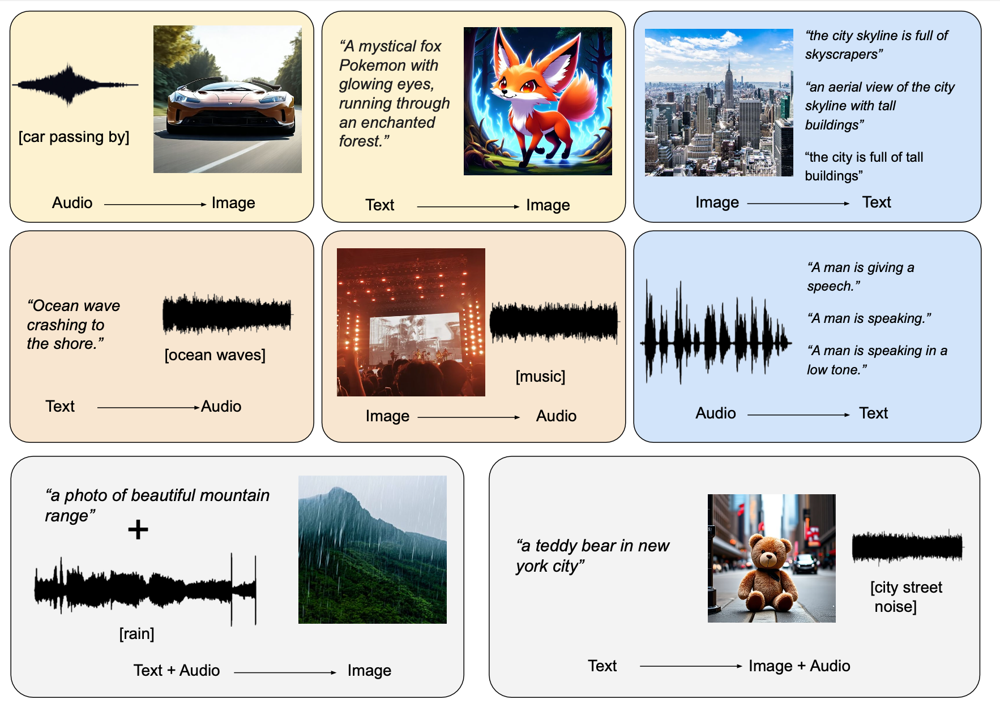

# OmniFlow: Any-to-Any Generation with Multi-Modal Rectified Flows

<p align="center">
     <br>
</p>


This repository contains the official code and checkpoints used in the paper "[OmniFlow: Any-to-Any Generation with Multi-Modal Rectified Flows](https://arxiv.org/abs/2412.01169)"


## Environment Setup

```
conda create --name python=3.10
pip3 install torch torchvision torchaudio --index-url https://download.pytorch.org/whl/cpu
pip install -r requirements.txt
pip install -e .
```

## Download Checkpoints


Checkpoint (v0.5) is available on [Huggingface.](https://huggingface.co/jacklishufan/OmniFlow-v0.5/tree/main)

[Coming Soon: We are training a stronger model based on MMDiT-X proposed in SDv3.5]


## Inference 

```
from omniflow import  OmniFlowPipeline

pipeline = OmniFlowPipeline.load_pretrained('ckpts/v0.5',device='cuda')

pipeline.cfg_mode = 'new'
imgs = pipeline("portrait of a cyberpunk girl with neon tattoos and a visor,staring intensely. Standing on top of a building",height=512,width=512,add_token_embed=0,task='t2i')

```

For more examples of Any-to-Any Generation, checkout `scripts/Demo.ipynb`

## Training 

See [scripts/training.md](scripts/training.md). We also release a filtered synthethic dataset containing text-audio-image triplets at [Huggingface](https://huggingface.co/datasets/jacklishufan/soundnet-flux-caption/tree/main)


## Citation

If you find OmniFlow useful in your research, please consider cite 

```
@article{li2024omniflow,
  title={OmniFlow: Any-to-Any Generation with Multi-Modal Rectified Flows},
  author={Li, Shufan and Kallidromitis, Konstantinos and Gokul, Akash and Liao, Zichun and Kato, Yusuke and Kozuka, Kazuki and Grover, Aditya},
  journal={arXiv preprint arXiv:2412.01169},
  year={2024}
}
```